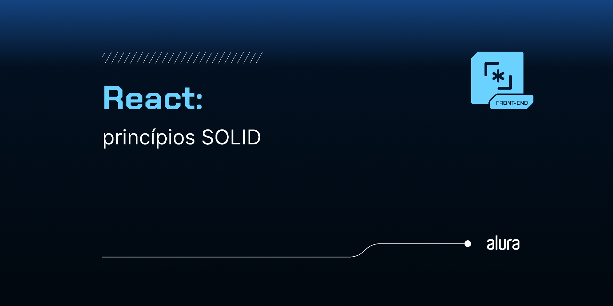

# Título do Curso: SOLID aplicado ao React: melhorando a modularidade e flexibilidade do código

Curso prático de SOLID em React, abordando todos os cinco princípios de design — Responsabilidade Única, Aberto/Fechado, Substituição de Liskov, Segregação de Interfaces e Inversão de Dependência. Aprenda a estruturar componentes e hooks customizados de forma modular, reutilizável e testável. Este curso mostra como aplicar os princípios SOLID para criar uma base de código flexível, desacoplada e escalável. Ideal para desenvolvedores que buscam fortalecer a manutenção e qualidade do código em React.

## 🔨 Funcionalidades do Projeto

O curso abrange a refatoração do Front-end de um e-commerce chamado `useDev`:

- Listagem de categorias e produtos.
- Exibição do detalhes do produto.
- Detalhes do carrinho de compras.

## ✔️ Técnicas e Tecnologias Utilizadas

As principais técnicas e tecnologias abordadas são:

- `SRP (Responsabilidade Única)`: componentes Button e Input apenas renderizam a label, sem lógica extra.
- `OCP (Aberto/Fechado)`: extensível para novos comportamentos sem alterar o código base dos componentes.
- `LSP (Substituição de Liskov)`: componentes podem ser trocados por versões especializadas sem quebrar a lógica.
- `ISP (Segregação de Interfaces)`: interfaces de props incluem apenas o necessário, mantendo os componentes leves.
- `DIP (Inversão de Dependência)`: hooks customizados dependem de abstrações, não de implementações concretas.

## 🎯 Desafios do Curso

Implementação de práticas avançadas, como:

- Estruturar componentes seguindo o princípio de Responsabilidade Única (SRP).
- Aplicar a Inversão de Dependência (DIP) ao utilizar serviços HTTP abstratos.
- Extender componentes sem modificar a lógica base, seguindo o princípio Aberto/Fechado (OCP).
- Desacoplar a lógica do `ProductService` do `useFetch` custom hook.

## 🛠️ Abrir e Rodar o Projeto

Após baixar o projeto, você pode abrir com seu editor de código preferido. Siga estes passos:

- Abra o terminal no diretório do projeto.
- Execute `npm install` para instalar as dependências.
- Inicie o servidor de desenvolvimento com `npm run dev`.
- Acesse `http://localhost:5173` no navegador para ver o projeto ou o endereço que for exibido no terminal.
